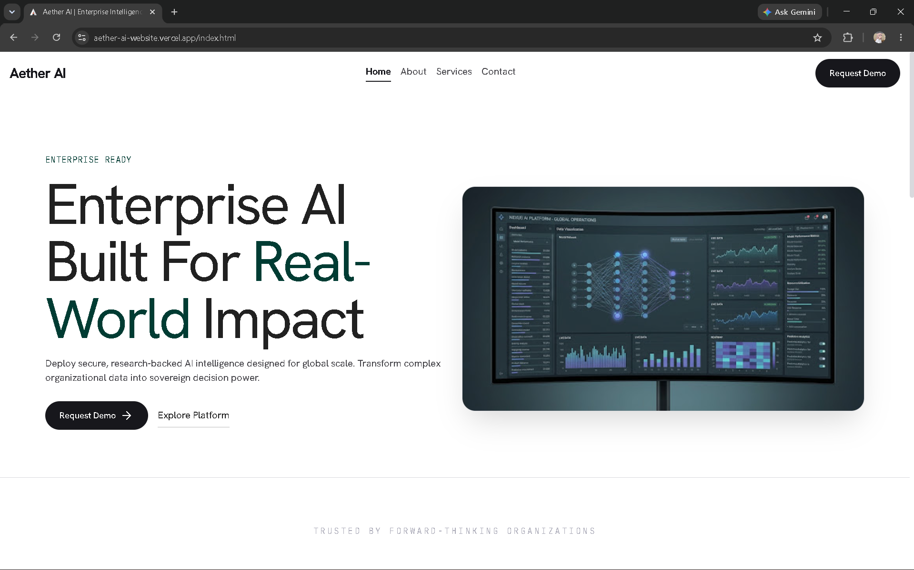
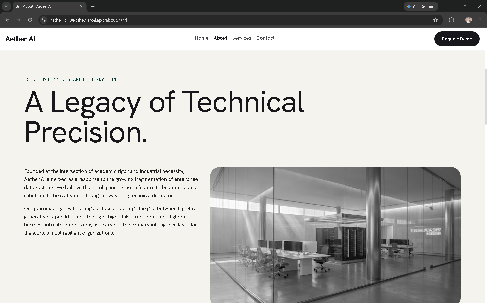
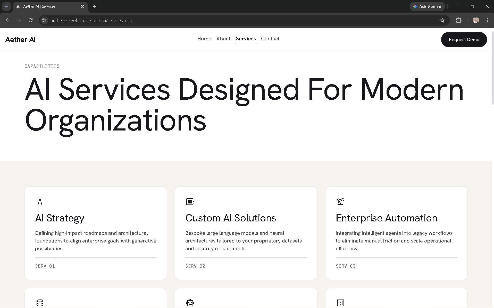
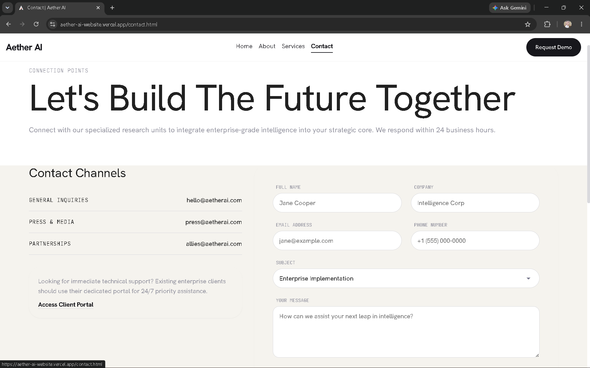

<p align="center">
  
</p>

<h1 align="center">Aether AI</h1>

<p align="center">
  <strong>Enterprise-grade AI infrastructure, beautifully crafted.</strong>
</p>

<p align="center">
  
  
  
  
  
</p>

<p align="center">
  <a href="#" style="display: inline-block; background-color: #4ade80; color: #0d1f1a; padding: 12px 24px; font-weight: bold; border-radius: 6px; text-decoration: none; font-family: -apple-system, BlinkMacSystemFont, 'Segoe UI', Roboto, Helvetica, Arial, sans-serif; box-shadow: 0 4px 15px rgba(74, 222, 128, 0.3); border: 2px solid #4ade80;">🚀 View Live Demo</a>
</p>

---

## 📸 Screenshots

<div align="center">
  <table>
    <tr>
      <td align="center" width="50%">
        <br>
        <sub><b>Home Page</b> — Enterprise portal showcasing platform capabilities and metrics.</sub>
      </td>
      <td align="center" width="50%">
        <br>
        <sub><b>About Page</b> — Deep dive into corporate mission, company timeline, and executive leadership.</sub>
      </td>
    </tr>
    <tr>
      <td align="center" width="50%">
        <br>
        <sub><b>Services Page</b> — Platform infrastructure offerings, workflow timeline, and detailed FAQ accordion.</sub>
      </td>
      <td align="center" width="50%">
        <br>
        <sub><b>Contact Page</b> — Responsive inquiry forms, validation rules, global offices, and newsletter block.</sub>
      </td>
    </tr>
  </table>
</div>

---

## 🚀 Key Features

* 📱 **Responsive Viewport Scaling** — Dynamic and fluid adjustments across desktop, tablet, and mobile layouts.
* ⚓ **Sticky Navigation Header** — Smart fixed navigation with active-page highlights and mobile drawer overlays.
* ✉️ **Isolated Newsletter Banner** — High-contrast deep-green subscription banner located above the footer.
* ⚙️ **Real-Time Input Validation** — Live client-side input validation checks with custom error messages.
* 💬 **Details/Summary Accordions** — Lightweight FAQ interactive lists utilizing native JS height calculations.
* 🎬 **Viewport Intersection Observer** — Scroll-triggered fade-in animations respecting user motion accessibility rules.

---

## 📁 Repository Structure

```
.
├── index.html              # Main homepage with company overview, capability cards, and metrics showcase
├── about.html              # Corporate mission page with values timeline, and technical leadership team grid
├── services.html           # Services catalog, "How We Work" interactive timeline, and FAQs accordion
├── contact.html            # Inquiry form with validation, location details, and newsletter subscription
├── 404.html                # Error page displaying system substrate node not found fallback layout
│
├── css/                    # Modular stylesheet files
│   ├── base.css            # Style system variables, color codes, fonts, and baseline reset rules
│   ├── layout.css          # Standard containers, section spacing wrappers, grid and flex setups
│   ├── components.css      # Reusable UI components (buttons, navbars, cards, accordions, inputs)
│   ├── pages.css           # Page-specific styling offsets and custom visual enhancements
│   ├── responsive.css      # Breakpoint media query rules for stackable columns and scale shifts
│   └── utilities.css       # Utility helpers (margins, paddings, text alignments, shadows)
│
├── js/                     # Vanilla JS application modules
│   ├── navigation.js       # Navbar sticky transition handlers, active page highlight, and mobile hamburger drawer
│   ├── forms.js            # Input validation, regular expression email checks, and mock submit states
│   ├── animations.js       # Viewport intersection scroll triggers and accordion height toggle listeners
│   └── main.js             # Central entry point that initializes event listeners on DOMContentLoaded
│
├── assets/                 # Local media asset files
│   ├── images/             # Static graphics divided by sections
│   │   ├── home/           # Hero graphics and home section pictures
│   │   ├── about/          # About background stories and leadership node images
│   │   ├── services/       # Services flow icons and showcase media
│   │   └── contact/        # Contact background maps and office graphics
│   ├── icons/              # Custom brand utility vector icons
│   └── logo/               # Vector SVG/PNG branding logos and favicon link files
│       ├── aether-logo.svg # Vector SVG brand logo with custom 3D geometric shapes
│       ├── aether-logo.png # High-resolution PNG brand logo copy for static preview
│       └── favicon.ico     # Multi-resolution favicon link file for web browsers
│
├── screenshots/            # Repository screenshots directory for user documentation
│
├── docs/                   # Platform documentation folder
│   └── design-decisions.md # Architectural records logging layout, colors, and styling rules
│
├── README.md               # Visual repository overview and setup guidelines (this file)
├── .gitignore              # Instructions for Git to ignore tracking specific temporary local files
└── favicon.ico             # Fallback duplicate favicon link file at repository root
```

---

## ⚡ Quick Start

Get the Aether AI platform running locally on your machine in under a minute:

```bash
# Clone the repository
git clone https://github.com/khushi897920-lang/aether-ai-website.git

# Navigate into the project folder
cd aether-ai-website

# Spin up a fast local development server
npx serve
```

*Note: Alternatively, if you do not have Node.js/npx, you can run `python -m http.server 8000` to serve the static assets immediately.*

---

## 🛠️ Tech Stack & Details

| Technology | Purpose | Version/Notes |
| :--- | :--- | :--- |
| **HTML5** | Semantic structure and SEO metadata tags | HTML5 Standard |
| **CSS3** | Modular styles, custom properties, and responsive grid layouts | CSS3 Standard |
| **Vanilla JS** | Event handling, form checking, and scrolling transitions | ES6+ / No Frameworks |
| **Vercel** | Live production cloud hosting and instant builds | Automated Deployment |

---

<p align="center">
  Made with 💚 by <b>Khushi Singh</b> · WeIntern Week 2 task 1
</p>
